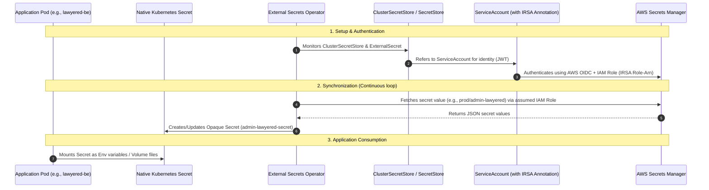

# EKS Secret Management: External Secrets Operator (ESO) Staging Blueprint

This guide provides a comprehensive explanation of how the **External Secrets Operator (ESO)** manages secrets within your Amazon EKS cluster, breaks down the current production setup, and provides a step-by-step implementation blueprint to mirror this configuration in your **Staging** environment.

---

## 1. What is External Secrets Operator (ESO)?

In standard Kubernetes, secrets are stored as base64-encoded strings within `Secret` manifests. While this obfuscates the sensitive values, it does **not** encrypt them, and committing these files to Git repositories is a major security risk.

**External Secrets Operator (ESO)** is a Kubernetes operator that bridges Kubernetes with external secret managers (like AWS Secrets Manager, HashiCorp Vault, or Google Secret Manager). It allows you to:
1. Store all sensitive data securely in a centralized store (**AWS Secrets Manager**).
2. Store only non-sensitive Kubernetes declarations (`ExternalSecret`) in your Git repository (e.g., through ArgoCD).
3. Automatically synchronize secrets from AWS into native Kubernetes Secrets in real time (e.g., polling every 1 hour).

### Conceptual Architecture & Secret Flow

Here is how the components interact inside your cluster:



---

## 2. Deep Dive: Decoding the Production Configuration

Let's dissect each of the files you extracted from the bastion host and GitHub to understand how your senior configured the production environment.

### A. The Security Bridge: ServiceAccount (`eso-prod-shared.yaml`)
```yaml
apiVersion: v1
kind: ServiceAccount
metadata:
  name: eso-prod-shared
  namespace: prod
  annotations:
    eks.amazonaws.com/role-arn: arn:aws:iam::857277800188:role/ESOProdSharedRole
```
*   **What is a ServiceAccount?** In Kubernetes, a `ServiceAccount` provides an identity for processes that run in a Pod.
*   **What is the `eks.amazonaws.com/role-arn` annotation?** This is the core of **IRSA (IAM Roles for Service Accounts)**. It tells EKS: *"Whenever a pod uses this ServiceAccount, EKS should intercept its calls and inject AWS credentials corresponding to the IAM Role `ESOProdSharedRole`."*
*   **How does EKS authorize this?** In AWS, the `ESOProdSharedRole` has a **Trust Policy** pointing to the EKS cluster's **OIDC Provider**. The trust policy dictates that only the `ServiceAccount` named `eso-prod-shared` in the `prod` namespace can assume this role. This is highly secure because it eliminates the need to distribute static AWS Access Keys (`AWS_ACCESS_KEY_ID`) inside the cluster.

### B. The Connection Config: ClusterSecretStore (`clustersecretstore.yaml`)
```yaml
apiVersion: external-secrets.io/v1
kind: ClusterSecretStore
metadata:
  name: aws-secrets-manager
spec:
  provider:
    aws:
      service: SecretsManager
      region: ap-south-1
      auth:
        jwt:
          serviceAccountRef:
            name: eso-prod-shared
            namespace: prod
```
*   **ClusterSecretStore vs. SecretStore:** A `SecretStore` is namespaced (limited to one namespace). A `ClusterSecretStore` is cluster-scoped, meaning any namespace in the cluster can reference it.
*   **What does it do?** It acts as a connector. It specifies:
    *   **Provider:** AWS Secrets Manager
    *   **Region:** `ap-south-1`
    *   **Auth Mechanism:** Uses the JWT (Json Web Token) projected onto the `eso-prod-shared` ServiceAccount in the `prod` namespace to assume the IAM role.

### C. The Fetch Request: ExternalSecret (`externalsecret.yaml`)
```yaml
apiVersion: external-secrets.io/v1
kind: ExternalSecret
metadata:
  name: admin-lawyered-secret
  namespace: prod
spec:
  refreshInterval: 1h
  secretStoreRef:
    name: aws-secrets-manager
    kind: ClusterSecretStore
  target:
    name: admin-lawyered-secret
    creationPolicy: Owner
  dataFrom:
    - extract:
        key: prod/admin-lawyered
```
*   **What does it do?** This is the custom resource that tells the ESO Controller to synchronize a specific secret.
*   **Key Parameters Explained:**
    *   `refreshInterval: 1h`: ESO checks AWS Secrets Manager every 1 hour for any updates. If values change in AWS, the local Kubernetes Secret is updated automatically.
    *   `secretStoreRef`: Points to our `aws-secrets-manager` `ClusterSecretStore` for connection details.
    *   `target.name`: The name of the native Kubernetes `Secret` that ESO will generate. In this case, it creates an `Opaque` Kubernetes Secret named `admin-lawyered-secret` in the `prod` namespace.
    *   `creationPolicy: Owner`: If the `ExternalSecret` manifest is deleted from the cluster, Kubernetes will automatically delete the generated Secret (acting as the "Owner").
    *   `dataFrom.extract.key`: The exact name of the secret path in **AWS Secrets Manager** (e.g., `prod/admin-lawyered`).

---

## 3. Step-by-Step Staging Setup Blueprint

To set up secret management for your **Staging** environment, follow this structured, 6-step workflow.

### Step 1: Install External Secrets Operator (ESO) via Helm
If staging is a separate EKS cluster, you need to install the operator first. If staging is a namespace (`staging`) within the same EKS cluster, you can skip this step since the production operator is already running cluster-wide.

To install the operator via Helm in your staging cluster:
```bash
# Add the Helm repository
helm repo add external-secrets https://charts.external-secrets.io

# Update the repository charts
helm repo update

# Install the operator in a dedicated namespace
helm install external-secrets external-secrets/external-secrets \
  --namespace external-secrets \
  --create-namespace \
  --set installCRDs=true
```
*This installs three core deployments inside the `external-secrets` namespace:*
1.  `external-secrets`: Reconciles ExternalSecret objects and communicates with AWS.
2.  `external-secrets-webhook`: Validates/mutates the custom resources.
3.  `external-secrets-cert-controller`: Manages TLS certs for the webhook.

---

### Step 2: Provision Staging AWS IAM Role (`ESOStagingSharedRole`)
You need to create an IAM role that grants access specifically to staging secrets in AWS Secrets Manager. You can define this role in your Terraform codebase or create it manually.

#### Option A: Terraform Configuration (Recommended)
Add this to your staging Terraform templates:

```hcl
# 1. AWS IAM Policy for Staging Secrets Manager access
resource "aws_iam_policy" "eso_staging_policy" {
  name        = "ESOStagingSecretsPolicy"
  description = "Allows EKS External Secrets Operator to access staging secrets"

  policy = jsonencode({
    Version = "2012-10-17"
    Statement = [
      {
        Effect = "Allow"
        Action = [
          "secretsmanager:GetSecretValue",
          "secretsmanager:DescribeSecret"
        ]
        # Restrict permissions specifically to secrets prefixed with staging/
        Resource = "arn:aws:secretsmanager:ap-south-1:857277800188:secret:staging/*"
      }
    ]
  })
}

# 2. AWS IAM Role with OIDC Trust Relationship for EKS Staging Cluster
resource "aws_iam_role" "eso_staging_role" {
  name = "ESOStagingSharedRole"

  assume_role_policy = jsonencode({
    Version = "2012-10-17"
    Statement = [
      {
        Effect = "Allow"
        Principal = {
          Federated = "arn:aws:iam::857277800188:oidc-provider/oidc.eks.ap-south-1.amazonaws.com/id/<YOUR_STAGING_OIDC_ID>"
        }
        Action = "sts:AssumeRoleWithWebIdentity"
        Condition = {
          StringEquals = {
            # Restricts role assumption strictly to the service account in staging namespace
            "oidc.eks.ap-south-1.amazonaws.com/id/<YOUR_STAGING_OIDC_ID>:sub" = "system:serviceaccount:staging:eso-staging-shared"
            "oidc.eks.ap-south-1.amazonaws.com/id/<YOUR_STAGING_OIDC_ID>:aud" = "sts.amazonaws.com"
          }
        }
      }
    ]
  })
}

# 3. Attach Policy to Role
resource "aws_iam_role_policy_attachment" "eso_staging_attach" {
  role       = aws_iam_role.eso_staging_role.name
  policy_arn = aws_iam_policy.eso_staging_policy.arn
}
```

---

### Step 3: Create the Staging Namespace and ServiceAccount
Create the `staging` namespace and the `eso-staging-shared` ServiceAccount.

```yaml
# namespace-staging.yaml
apiVersion: v1
kind: Namespace
metadata:
  name: staging
  labels:
    environment: staging

---
# eso-staging-shared.yaml
apiVersion: v1
kind: ServiceAccount
metadata:
  name: eso-staging-shared
  namespace: staging
  labels:
    environment: staging
    managed-by: external-secrets-operator
  annotations:
    # Anchor this service account to the staging IAM Role
    eks.amazonaws.com/role-arn: arn:aws:iam::857277800188:role/ESOStagingSharedRole
```
Apply these using kubectl:
```bash
kubectl apply -f namespace-staging.yaml
kubectl apply -f eso-staging-shared.yaml
```

---

### Step 4: Create the Staging ClusterSecretStore
Create the connection from your EKS staging environment to AWS Secrets Manager using the staging ServiceAccount.

```yaml
# clustersecretstore-staging.yaml
apiVersion: external-secrets.io/v1
kind: ClusterSecretStore
metadata:
  name: aws-secrets-manager-staging
  labels:
    environment: staging
    managed-by: external-secrets-operator
spec:
  provider:
    aws:
      service: SecretsManager
      region: ap-south-1
      auth:
        jwt:
          serviceAccountRef:
            name: eso-staging-shared
            namespace: staging
```
Apply using kubectl:
```bash
kubectl apply -f clustersecretstore-staging.yaml
```

---

### Step 5: Store Secrets in AWS Secrets Manager
Log into the AWS Console or use the AWS CLI to store secrets using the `staging/` prefix:

*   **Secret Name:** `staging/admin-lawyered`
*   **Secret Type:** Other type of secret (Key/value)
*   **Key/Value Pairs:**
    *   `DATABASE_URL` = `postgresql://staging-db:5432/db`
    *   `API_KEY` = `staging-api-key-value`

Using the AWS CLI:
```bash
aws secretsmanager create-secret \
  --name "staging/admin-lawyered" \
  --description "Staging secrets for admin-lawyered application" \
  --secret-string '{"DATABASE_URL":"postgresql://staging-db:5432/db","API_KEY":"staging-api-key-value"}' \
  --region ap-south-1
```

---

### Step 6: Deploy Staging ExternalSecret Manifests
Now deploy the `ExternalSecret` manifests that reference the staging store and staging secrets.

```yaml
# staging-externalsecrets.yaml
apiVersion: external-secrets.io/v1
kind: ExternalSecret
metadata:
  name: admin-lawyered-secret
  namespace: staging
  labels:
    app: admin-lawyered
    environment: staging
    managed-by: external-secrets-operator
spec:
  refreshInterval: 1h
  secretStoreRef:
    name: aws-secrets-manager-staging
    kind: ClusterSecretStore
  target:
    name: admin-lawyered-secret
    creationPolicy: Owner
  dataFrom:
    - extract:
        key: staging/admin-lawyered

---
apiVersion: external-secrets.io/v1
kind: ExternalSecret
metadata:
  name: admin-lawyered-fe-secret
  namespace: staging
  labels:
    app: admin-lawyered-fe
    environment: staging
    managed-by: external-secrets-operator
spec:
  refreshInterval: 1h
  secretStoreRef:
    name: aws-secrets-manager-staging
    kind: ClusterSecretStore
  target:
    name: admin-lawyered-fe-secret
    creationPolicy: Owner
  dataFrom:
    - extract:
        key: staging/admin-lawyered-fe
```
Apply using kubectl:
```bash
kubectl apply -f staging-externalsecrets.yaml
```

---

## 4. Verification: How to Check if It's Working

Once applied, verify that the secrets have successfully synced:

1.  **Check ExternalSecret Resource Status:**
    ```bash
    kubectl get externalsecret -n staging
    ```
    *Look for the `STATUS` column; it should read `SecretSynced`.*

2.  **Describe the ExternalSecret for detailed logs:**
    ```bash
    kubectl describe externalsecret admin-lawyered-secret -n staging
    ```
    *Check the `Events:` section at the bottom. You should see a successful reconciliation event: `Created Secret`.*

3.  **Verify the Native Kubernetes Secret was generated:**
    ```bash
    kubectl get secret admin-lawyered-secret -n staging
    ```

4.  **Confirm the contents inside the native Secret (base64 decoded):**
    ```bash
    kubectl get secret admin-lawyered-secret -n staging -o jsonpath='{.data}'
    # Or decode a specific key (e.g. DATABASE_URL):
    kubectl get secret admin-lawyered-secret -n staging -o jsonpath='{.data.DATABASE_URL}' | base64 --decode
    ```

---

## 5. Frequently Asked Questions

*   **Q: Can we change the sync interval?**
    Yes! You can change `refreshInterval: 1h` to something shorter like `5m` (5 minutes) or `30s` (30 seconds) during debugging, though `1h` is generally recommended for production to avoid hitting AWS Secrets Manager API rate limits.
*   **Q: What happens if I update a secret value in AWS Secrets Manager?**
    ESO will pick up the change on its next refresh cycle (defined by `refreshInterval`) and update the local Kubernetes secret immediately. There is no need to restart pods unless your application does not support hot-reloading env variables.
*   **Q: What if EKS cannot assume the IAM role?**
    Make sure that the EKS cluster's OIDC Provider URL matches the trust relationship principal in the `ESOStagingSharedRole` IAM Role, and that the ServiceAccount name and namespace are exact matches.
