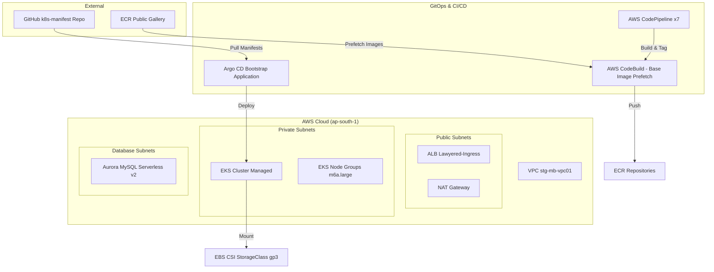

# 📜 Automated Infrastructure Journal

This file is automatically maintained by your AI assistant (Antigravity). It records every infrastructure change, command, and progress milestone in chronological order.

---

## 🗺️ Project Architecture Diagram



---

## 📂 File Structure Hierarchy

```text
resources/
├── argocd-manifests/           # Argo CD Application Manifests (Managed by Terraform)
│   ├── infrastructure-storage/ # Cluster-wide resources (StorageClass)
│   ├── admin-lawyered.yaml
│   ├── api-challans.yaml
│   └── ... (microservice apps)
├── modules/                    # Reusable Terraform Infrastructure Modules
│   ├── argocd/                 # Helm-based Argo CD installation
│   ├── aurora/                 # Database cluster management
│   ├── codepipeline/           # CI/CD pipeline factory
│   ├── ecr/                    # Image repository management
│   ├── eks/                    # Core K8s cluster logic
│   └── eks-addons/             # CNI, CoreDNS, Procy, EBS CSI logic
├── templates/                  # Environment-specific configuration
│   ├── main.tf                 # Root orchestration and Bootstrap loop
│   ├── terraform.tfvars        # Deployment variables (VPC/Cluster maps)
│   └── backend.tf              # S3 Remote State configuration
├── JOURNAL.md                  # This Live Tracking File
└── README.md                   # Project Operations Manual
```

---

## 🗓️ April 24, 2026 - Milestone: "A to Y" Full Stack Automation

### **Task: EBS CSI Driver Installation**
- **Action**: Enabled the `aws-ebs-csi-driver` managed addon in `modules/eks-addons`.
- **Reason**: To support persistent storage and the `ebs-sc` (gp3) StorageClass for databases.
- **Outcome**: The cluster can now provision dynamic EBS volumes automatically.

### **Task: Manifest Bootstrap Loop**
- **Action**: Implemented a `kubectl_manifest` loop in `templates/main.tf` using the `fileset` function.
- **Reason**: To achieve "A to Z" (or "A to Y") automation where Terraform applies the Argo CD Applications directly.
- **Outcome**: All 7 microservices are now automatically registered in Argo CD upon `terraform apply`.

### **Task: Hybrid GitOps Strategy**
- **Action**: Decision to manage Application manifests in Terraform but keep Repository Credentials manual in the UI.
- **Reason**: Respecting the user's current security setup while automating the app delivery layer.
- **Outcome**: Simplified Terraform state and eliminated the need to handle sensitive SSH keys in code.

### **Task: Aurora Database Optimization (Infrastructure Hardening)**
- **Objective**: Standardize database settings and enable observability through automated logging.
- **Files Modified**: 
  - `modules/aurora/main.tf`: Added parameter group resources and logging configurations.
- **Detailed Actions**:
    - **Resource `aws_rds_cluster_parameter_group`**: Created `lawyered-database-cluster-pg` (family: `aurora-mysql8.0`). This governs cluster-level settings like replication and binary logging.
    - **Resource `aws_db_parameter_group`**: Created `lawyered-database-mysql-pg` (family: `aurora-mysql8.0`). This governs instance-level settings like memory usage and connection limits.
    - **Log Integration**: Enabled `enabled_cloudwatch_logs_exports` for `error` and `slowquery` in the `aws_rds_cluster` resource.
- **Logical Flow**: Terraform provisions the parameter groups first, then maps the Cluster PG to the DB Cluster and the Instance PG to each individual DB Instance.
- **Outcome**: Successfully generated a `terraform plan` showing a clean transition to managed parameter groups without resource destruction.

---

## 🗓️ April 23, 2026

### **Task: Pipeline Scaling**
- **Action**: Successfully scaled the CodePipeline module to 7 microservices.
- **Outcome**: 100% CI/CD coverage for the organization.

### **Task: Manual CI/CD Execution (QR API & API Challans)**
- **Date**: April 24, 2026
- **Action**: Manually triggered `qr-api-pipeline` and `api-challans-pipeline` via AWS CLI.
- **CD Sync**: User initiated manual sync via Argo CD UI to confirm microservice stability.
- **Outcome**: Successfully bypassed the commit-wait time for priority service updates.

---

## 🗓️ April 22, 2026

### **Task: Infrastructure Hardening**
- **Argo CD Ingress Refactoring**: Resolved circular provider dependencies.
- **Docker Hub 429 Fix**: Implemented ECR Public Gallery pre-fetching.
- **Framework Support**: Corrected Vite/React build paths and integrated Build Args.

---
*Next entries will be appended automatically as we work.*
